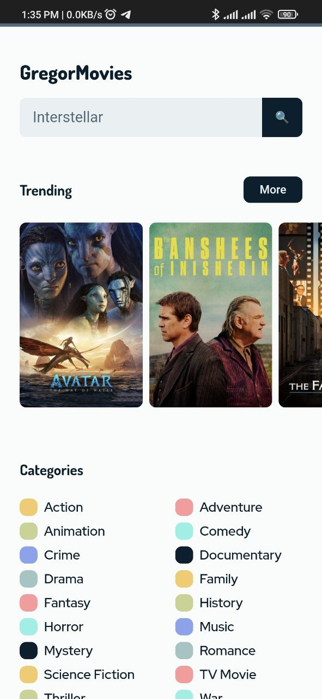
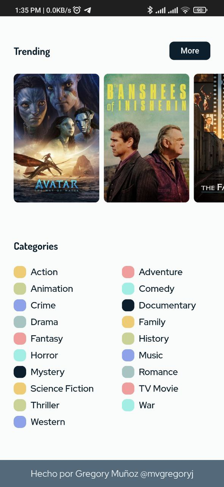
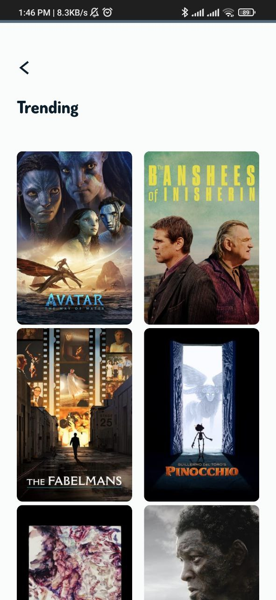
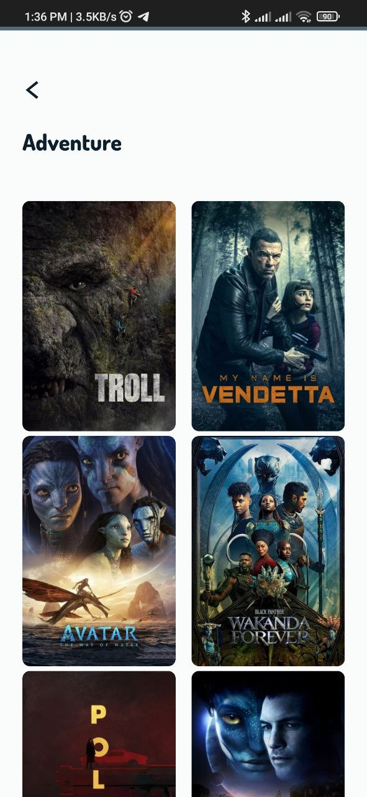
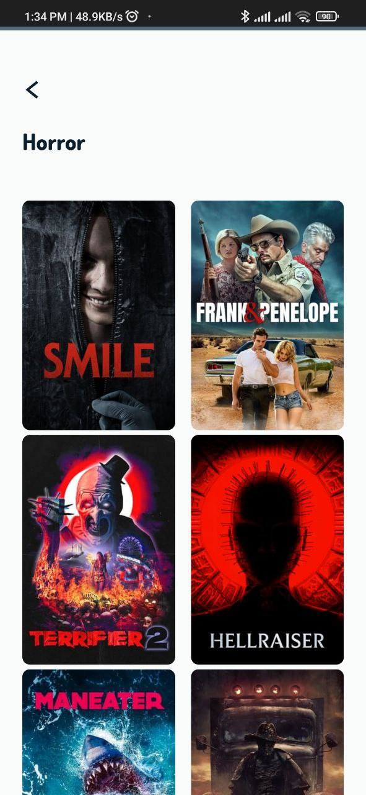
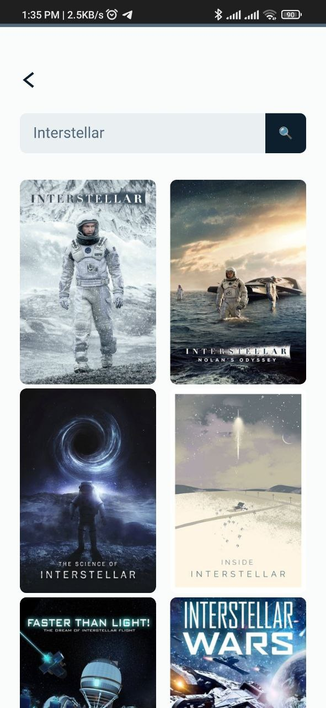
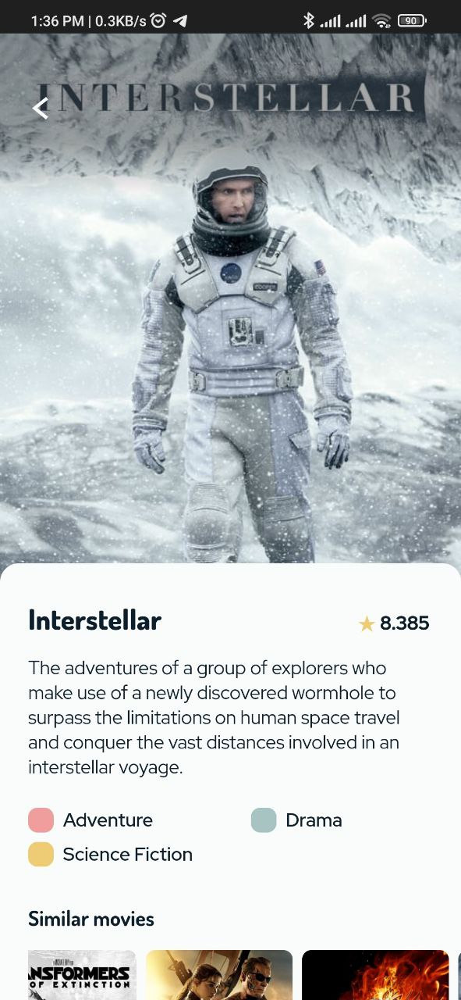
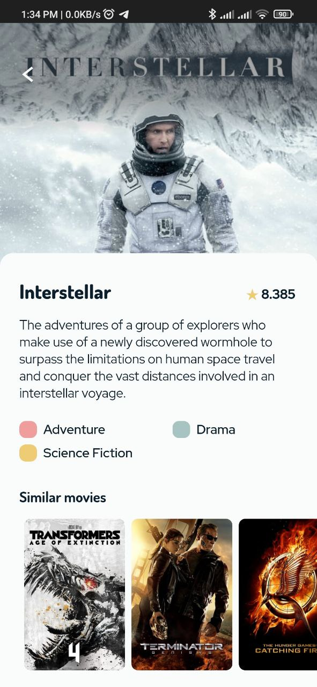

# GregorMovies
Proyecto de **página web mobile** en el cual se realiza consumo de API REST con JavaScript.

Usaremos la API de The Movie Database para construir nuestra aplicación.

https://developers.themoviedb.org/3/getting-started/introduction

## Link
https://mvgregoryj.github.io/GregorMovies

 

## Vistas

### Home

 

### Trending

 

### Categories

#### Adventure

 

#### Horror

 

### Search

 

### Movie

